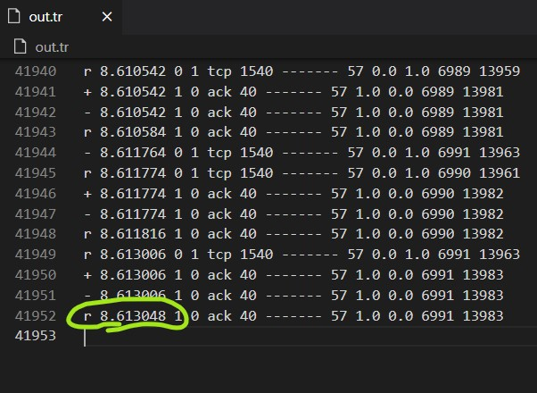

NS2
===

- [duplex link](./basics/duplexLink.tcl)
- [ftp over tcp](./basics/ftpOverTCP.tcl)

[__Ring Topology__](./basics/ringTopology.tcl)
---

https://user-images.githubusercontent.com/56071758/117620858-892f8f80-b18e-11eb-8cc7-c1fd5a52b222.mp4

__[cbr over UDP](./basics/cbrOverUDP.tcl)__
---

# [Q1](./experiments/q1.tcl)

Consider a small network with five nodes n0, n1, n2, n3, n4, forming a star topology.   
The node n4 is at the center.  
- Node **n0 is a TCP source**, which transmits packets to **node n3 (a TCP sink)** *through the node n4*.  
- Node **n1 is another traffic source**, and *sends UDP packets* **to node n2** *through n4*.  
- The duration of the ***simulation time is 10 seconds***.

# [Q2 File transfer ](./experiments/fileTransfer.tcl)

Consider a client and a server. The server is running a FTP application (over
TCP). 
The client sends a request to download a **file of size 10 MB** from the server. Write a script to simulate this scenario. 
- Let node #0 be the server
- Let node #1 be the client. 
- TCP packet size is 1500 B. 
- Assume typical values for
other parameters.

--- 
> by looking in out.tr (i.e. trace file) we can find total time taken to transfer the file

According the values assumed in the fileTransfer.tcl code  
- 8.613048 seconds utilized to send the 10MB file when link-bandwidth = 10Mb , delay = 0.01ms

*It may vary according to other values we assume in our code.*