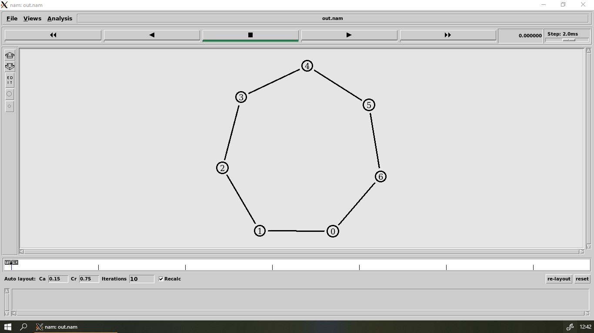

NS2
===

- [duplex link](./basics/duplexLink.tcl)
- [ftp over tcp](./basics/ftpOverTCP.tcl)

[__Ring Topology__](./basics/ringTopology.tcl)
---

https://user-images.githubusercontent.com/56071758/117620858-892f8f80-b18e-11eb-8cc7-c1fd5a52b222.mp4

